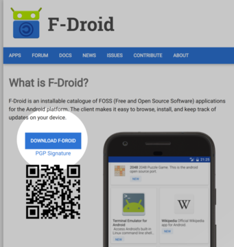
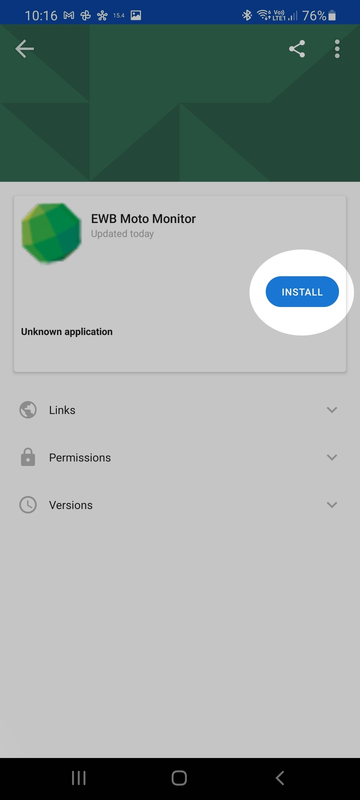

# EWB Moto monitoring app

##  Overview

The purpose of the EWB moto monitoring app is to record gps and accelerometer on an android phone and transmit these reading to a central server.

## Installation

The application is distributed from a private repository using the [F-Droid](https://f-droid.org/) application distribution architecture.

### Installation steps

####  1. Install the F-Droid application from the [F-Droid](https://f-droid.org/) site.

####  2. Open F-Droid application

####  3. Click on settings

####  4. Click on repositories

####  5. Add new repository with url htts://repo.ewbaus.org/fdroid/

####  6. Go back to home back and search for EWB

####  7. Click install and dismiss any security/Play protect warning messages

